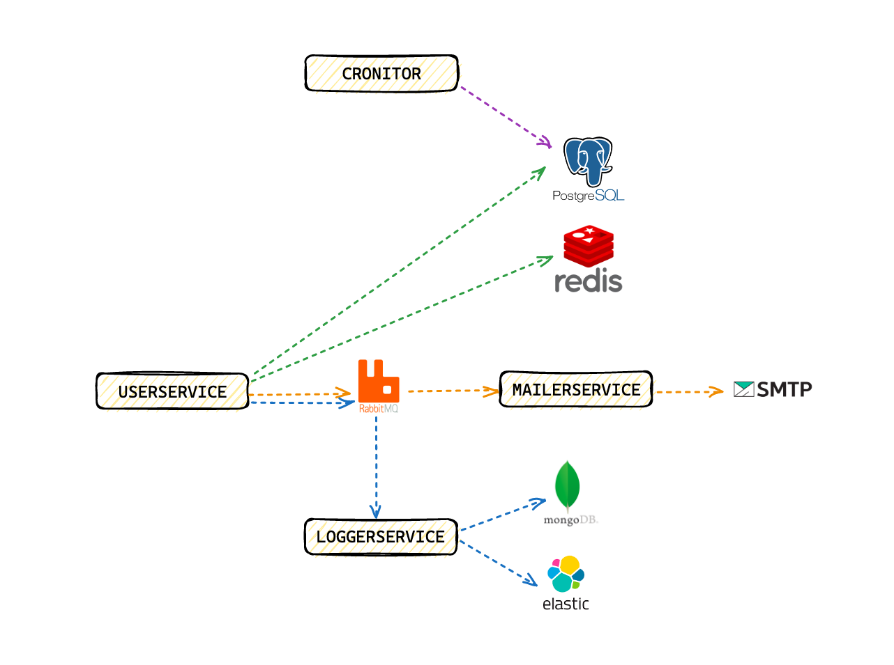

# GOLANG MICROSERVICE E COMMERCE PROJECT

## APP PORTS
- 3001 userservice
- 3002 mailerservice
- 3003 loggerservice

## OTHER PORTS
- 5432 postgres
- 5050 pgadmin
- 27017 mongo
- 8081 mongo-express
- 9200 elasticsearch
- 5601 kibana
- 6379 redis
- 8082 redis-commander
- 5672 rabbitmq
- 15672 rabbitmq-management




### POSTMAN COLLECTIONS
- [POSTMAN COLLECTIONS](https://github.com/mkaganm/golang-microservice-ecommerce-project/tree/master/postman-collections)


### BUILD
```bash
make build
```

### RUN
```bash
make run
```

# SERVICES

## USERSERVICE

### ENDPOINTS

#### REGISTER
- [POST] /api/v1/user/register
- [POST] /api/v1/user/confirm-register
- [POST] /api/v1/user/send-verificaton-code

#### LOGIN
- [POST] /api/v1/user/login

#### CHANGE PASSWORD
- [POST] /api/v1/user/change-password

#### FORGOT PASSWORD
- [POST] /api/v1/user/send-verificaton-code
- [POST] /api/v1/user/forgot-password

## MAILERSERVICE
- [POST] /api/v1/mailer/send

## LOGGERSERVICE
- [POST] /api/v1/logger/mongoLog
- [GET] /api/v1/logger/log
- [POST] /api/v1/logger/elasticLog

